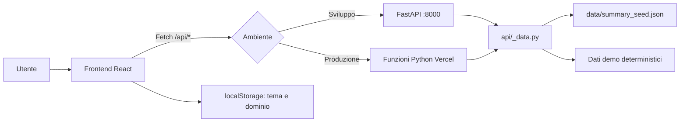

# Perimetra — Security Report Dashboard

Perimetra è un’applicazione web dimostrativa che trasforma un report JSON sulla sicurezza di un dominio in un cruscotto navigabile. Riunisce in un’unica interfaccia rischio complessivo, vulnerabilità, data leak, superficie di rete, certificati, sicurezza email e possibili domini di phishing.

Il progetto è full stack: **React e TypeScript** nel browser, **Python e FastAPI** durante lo sviluppo locale, **funzioni serverless Python su Vercel** in produzione. I dati inclusi sono esclusivamente dimostrativi e non descrivono infrastrutture reali.

## Indice

- [Panoramica](#panoramica)
- [Funzionalità](#funzionalità)
- [Come funziona](#come-funziona)
- [Architettura](#architettura)
- [Struttura del progetto](#struttura-del-progetto)
- [Tecnologie, framework e librerie](#tecnologie-framework-e-librerie)
- [Dati e domini dimostrativi](#dati-e-domini-dimostrativi)
  - [Provenienza dei dati: originali, derivati e inventati](#provenienza-dei-dati-originali-derivati-e-inventati)
- [API](#api)
- [Requisiti](#requisiti)
- [Installazione e avvio locale](#installazione-e-avvio-locale)
- [Script disponibili](#script-disponibili)
- [Build di produzione](#build-di-produzione)
- [Deploy su Vercel](#deploy-su-vercel)
- [Design e accessibilità](#design-e-accessibilità)
- [Limitazioni](#limitazioni)
- [Risoluzione dei problemi](#risoluzione-dei-problemi)
- [Possibili sviluppi futuri](#possibili-sviluppi-futuri)
- [Licenza](#licenza)

## Panoramica

Un report di sicurezza può contenere molti punteggi, conteggi e dettagli tecnici difficili da consultare direttamente in formato JSON. Perimetra organizza queste informazioni in pagine tematiche, indicatori visivi, grafici e tabelle filtrabili.

L’applicazione è pensata come esercizio dimostrativo full stack e come prototipo di interfaccia per:

- analisti di sicurezza che devono ottenere rapidamente una visione d’insieme;
- responsabili IT che vogliono individuare le aree più rischiose;
- revisori tecnici interessati all’architettura frontend/backend;
- utenti non tecnici che necessitano di un riepilogo leggibile del report.

Perimetra **non esegue scansioni** e non contatta domini esterni. Visualizza un report fornito e genera dati aggiuntivi deterministici per rendere esplorabili tutte le sezioni della demo.

## Funzionalità

### Panoramica

La pagina iniziale (`/`) presenta:

- indicatore circolare del rischio complessivo su una scala da 0 a 100;
- KPI per asset, indirizzi IP, domini simili, certificati e vulnerabilità;
- andamento simulato del rischio negli ultimi 90 giorni;
- punteggi delle singole categorie di rischio;
- distribuzione delle vulnerabilità per gravità;
- distribuzione dei data leak per categoria;
- riepilogo esecutivo selezionabile in italiano o inglese.

### Vulnerabilità

La pagina `/vulnerabilita` mostra la distribuzione per gravità e una tabella di dettaglio. È possibile filtrare per:

- gravità: critica, alta, media, bassa o informativa;
- stato: attiva o passiva;
- testo contenuto in titolo, asset o identificativo.

### Data leak

La pagina `/data-leak` visualizza la distribuzione per categoria e lo stato di risoluzione. La tabella può essere filtrata per categoria, record risolti/non risolti e ricerca testuale su identificativo o fonte.

Per evitare tabelle eccessivamente grandi, il backend restituisce al massimo 25 righe dimostrative per ciascuna categoria, mantenendo separati i conteggi complessivi del report.

### Rete e porte

La pagina `/rete` riassume:

- numero di asset;
- indirizzi IPv4 e IPv6 unici;
- punteggio relativo alle porte aperte;
- numero di esposizioni per porta e servizio noto;
- presenza e copertura di Web Application Firewall (WAF);
- presenza e copertura di Content Delivery Network (CDN).

### Certificati e sicurezza email

La pagina `/certificati-email` comprende:

- certificati SSL/TLS attivi e scaduti;
- punteggio dei certificati;
- rilevazioni e liste blacklist monitorate;
- stato anti-spoofing;
- politica DMARC (`none`, `quarantine` o `reject`);
- punteggio combinato relativo all’esposizione delle email.

### Domini simili

La pagina `/domini-simili` elenca possibili varianti di typosquatting o phishing, con percentuale di similarità, stato di registrazione e segnale di rischio. La ricerca filtra i risultati per nome di dominio.

### Funzioni trasversali

- selezione fra tre domini dimostrativi;
- aggiornamento automatico delle pagine quando cambia il dominio;
- tema chiaro o scuro, inizializzato dalla preferenza del sistema;
- memorizzazione nel browser del dominio e del tema selezionati;
- stati di caricamento, errore e assenza di risultati;
- layout responsive per desktop, tablet e smartphone;
- grafici interattivi con informazioni al passaggio del puntatore.

## Come funziona

1. Il browser carica l’app React e inizializza `AppProvider`.
2. Il tema viene letto da `localStorage`; in assenza di una preferenza salvata, viene usato `prefers-color-scheme` del sistema operativo.
3. Il frontend richiede `GET /api/domains` per popolare il selettore.
4. Il dominio salvato, oppure `cybersonar.demo` come valore iniziale, viene usato per richiedere `GET /api/summary`.
5. Il Context React distribuisce report, stato di caricamento, eventuali errori, dominio e tema a tutta l’applicazione.
6. Le pagine di dettaglio caricano la propria risorsa tramite l’hook condiviso `useResource`.
7. I filtri lavorano nel browser sui dati già ricevuti; non effettuano una nuova chiamata API.
8. Se cambia dominio, le risorse dipendenti vengono richieste nuovamente.



## Architettura

### Frontend

Il frontend è una Single Page Application React. `BrowserRouter` associa le URL alle sei pagine, mentre sidebar e barra superiore rimangono condivise. Non è presente una libreria esterna per grafici o componenti UI: tabelle, gauge, barre e grafico temporale sono implementati con React, CSS e SVG.

Le richieste sono centralizzate in `frontend/src/api/client.ts` e usano sempre percorsi relativi `/api`. In sviluppo Vite inoltra queste richieste a FastAPI; in produzione vengono gestite dalle funzioni Python pubblicate da Vercel.

### Backend locale

`server/app/main.py` espone una API FastAPI sulla porta `8000`. È la modalità più comoda durante lo sviluppo perché offre reload automatico, validazione dei parametri e documentazione OpenAPI locale.

### Backend serverless

Ogni file pubblico in `api/` implementa una funzione serverless compatibile con Vercel usando `BaseHTTPRequestHandler` della libreria standard Python. Questa soluzione non richiede FastAPI nel runtime di produzione.

### Un’unica logica dati

Entrambi i backend importano `api/_data.py`. In questo modo caricamento del JSON, generazione dei domini demo e costruzione delle risposte non vengono duplicati e sviluppo e produzione restituiscono gli stessi dati.

FastAPI e le funzioni serverless differiscono soltanto nello strato HTTP. Un’eccezione è `GET /api/health`, disponibile esclusivamente nel server FastAPI locale.

## Struttura del progetto

```text
.
├── api/
│   ├── _data.py              # Lettura del seed e generazione deterministica dei dati
│   ├── _util.py              # Handler JSON/CORS comune alle funzioni Vercel
│   ├── domains.py            # GET /api/domains
│   ├── summary.py            # GET /api/summary
│   ├── history.py            # GET /api/history
│   ├── vulnerabilities.py    # GET /api/vulnerabilities
│   ├── dataleaks.py          # GET /api/dataleaks
│   └── similar.py            # GET /api/similar
├── data/
│   ├── summary_seed.json     # Report JSON sorgente per cybersonar.demo
│   └── project_brief.txt     # Descrizione originaria del compito
├── frontend/
│   ├── src/
│   │   ├── api/              # Client HTTP tipizzato
│   │   ├── components/       # Navigazione, tabelle, KPI e grafici riutilizzabili
│   │   ├── context/          # Stato globale di dominio, report e tema
│   │   ├── hooks/            # Hook generico per il caricamento delle risorse
│   │   ├── lib/              # Colori, soglie e formattazione
│   │   ├── pages/            # Sei pagine dell’applicazione
│   │   ├── styles/           # Token grafici e stili globali responsive
│   │   ├── types/            # Contratti TypeScript delle risposte API
│   │   ├── App.tsx           # Layout e definizione delle route
│   │   └── main.tsx          # Bootstrap React, Router e Context
│   ├── index.html            # Documento HTML di ingresso
│   ├── package.json          # Dipendenze e script npm
│   ├── package-lock.json     # Versioni risolte, incluse le dipendenze transitive
│   ├── tsconfig.json         # Compilazione e controlli TypeScript
│   └── vite.config.ts        # Alias @, porta 5173 e proxy /api
├── server/
│   ├── app/main.py           # API FastAPI per lo sviluppo locale
│   └── requirements.txt      # Dipendenze Python locali
├── .gitignore                # Esclusioni Git
└── vercel.json               # Build, runtime serverless e rewrite SPA
```

`frontend/node_modules/` contiene le dipendenze installate e `frontend/dist/` la build generata: entrambe sono escluse da Git.

## Tecnologie, framework e librerie

### Frontend: dipendenze runtime dirette

Le versioni riportate sono quelle dichiarate in `package.json`; `package-lock.json` conserva le versioni esatte risolte dall’installazione.

| Tecnologia | Versione dichiarata | Categoria | Utilizzo nel progetto |
|---|---:|---|---|
| React | `^18.3.1` | Libreria UI | Componenti, hook, rendering dichiarativo e gestione dello stato locale. |
| React DOM | `^18.3.1` | Renderer | Monta l’app React nell’elemento HTML `#root` tramite `createRoot`. |
| React Router DOM | `^6.26.0` | Routing frontend | Gestisce le route, i link e lo stato attivo della navigazione senza ricaricare la pagina. |

### Tooling e dipendenze di sviluppo

| Strumento | Versione dichiarata | Funzione |
|---|---:|---|
| Vite | `^5.4.0` | Server di sviluppo, proxy locale e bundler della build frontend. |
| `@vitejs/plugin-react` | `^4.3.1` | Integra React con Vite e trasforma JSX/TSX. |
| `@types/react` | `^18.3.3` | Definizioni TypeScript per React. |
| `@types/react-dom` | `^18.3.0` | Definizioni TypeScript per React DOM. |
| TypeScript / `tsc` | `^5.5.4` | Tipizza componenti, props, risposte API e modelli; esegue il type-check prima della build. Non viene caricato nel browser. |
| Modulo Node.js `path` | incluso in Node.js | Risolve il percorso assoluto dell’alias `@` nella configurazione Vite. |

`package-lock.json` include inoltre le dipendenze transitive necessarie a Vite, React Router, Babel ed esbuild. Non sono scelte direttamente dall’applicazione. Per ispezionarle si possono usare `npm ls --all` oppure il lockfile stesso.

Lo script `lint` richiama `eslint .`, ma **ESLint non è presente nelle dipendenze e non esiste una configurazione ESLint nel repository**. Nello stato attuale `npm run lint` termina quindi con un errore “comando non riconosciuto” o equivalente. Non va considerato un controllo operativo finché ESLint non viene aggiunto e configurato.

Il nome tecnico del pacchetto npm è ancora `cybersonar-dashboard`. È un identificatore interno ereditato dalla versione precedente del progetto e non modifica il brand visibile “Perimetra”.

### API Web native del browser

| API | Utilizzo |
|---|---|
| Fetch API | Esegue le richieste HTTP verso `/api`. |
| `localStorage` | Conserva tema e dominio selezionato nelle chiavi tecniche `cybersonar-theme` e `cybersonar-domain`. |
| `window.matchMedia` | Legge la preferenza di sistema per il tema scuro. |
| `ResizeObserver` | Adatta il grafico temporale alla larghezza disponibile. |
| `Intl.NumberFormat` | Formatta i conteggi in notazione compatta italiana. |
| `encodeURIComponent` | Codifica in sicurezza il dominio inserito nei parametri delle URL API. |
| DOM API | Applica `data-theme` all’elemento radice del documento. |
| SVG | Disegna gauge e grafico temporale senza librerie di charting. |

### Backend locale

| Tecnologia | Versione dichiarata | Categoria | Utilizzo |
|---|---:|---|---|
| Python | runtime Vercel `3.12` | Linguaggio | Caricamento, trasformazione e servizio dei dati. |
| FastAPI | `>=0.110` | Framework API | Route locali, validazione query, errori HTTP, CORS e OpenAPI. |
| Uvicorn con extra `standard` | `>=0.29` | Server ASGI | Avvia FastAPI durante lo sviluppo locale. |

FastAPI e Uvicorn servono esclusivamente alla modalità locale. Le funzioni serverless di produzione usano la libreria standard Python e non importano questi pacchetti.

### Moduli della libreria standard Python

| Modulo | Ruolo |
|---|---|
| `json` | Legge `summary_seed.json` e serializza le risposte serverless. |
| `random` | Genera dati demo con generatori pseudo-casuali a seed stabile. |
| `hashlib` | Produce identificativi ripetibili per i report sintetici. |
| `datetime`, `timedelta` | Costruiscono date e serie storiche. |
| `pathlib` | Risolve in modo portabile i percorsi del progetto e del seed JSON. |
| `sys` | Permette al server locale di importare il modulo condiviso in `api/`. |
| `http.server.BaseHTTPRequestHandler` | Implementa il livello HTTP delle funzioni Vercel. |
| `urllib.parse` | Analizza URL e parametri query nelle funzioni serverless. |
| `__future__.annotations` | Abilita la gestione differita delle annotazioni nei moduli condivisi. |

### Deploy e formati

- **Vercel** compila il frontend, pubblica `frontend/dist` e crea una funzione per ogni file `api/*.py`.
- **JSON** è il formato del seed e di tutte le risposte API.
- **CSS nativo** gestisce token, temi, layout, animazioni e media query.
- **HTML5** fornisce il documento di ingresso e gli elementi semantici dell’interfaccia.

## Dati e domini dimostrativi

### `summary_seed.json`

Il file contiene un oggetto con `status` e un array `results`. Il primo elemento di `results` è il report sorgente associato a `cybersonar.demo`. Fra i campi principali:

- `risk_score`: rischio complessivo da 0 a 100;
- `summary_text` e `summary_text_en`: riepiloghi esecutivi;
- `creation_date` e `last_edit`: date del report;
- punteggi specifici per servizi, leak, spoofing, porte, blacklist, vulnerabilità e certificati;
- `n_port`: conteggi per porta;
- `n_vulns`: vulnerabilità totali, attive e passive per gravità;
- `n_dataleak`: leak totali, risolti e non risolti per categoria;
- `email_security`, `waf` e `cdn`: postura email e protezioni di rete;
- asset, certificati, indirizzi IP e domini simili.

### Provenienza dei dati: originali, derivati e inventati

Per evitare ambiguità, l’applicazione utilizza tre categorie diverse di informazioni: valori letti direttamente dal JSON fornito, valori calcolati a partire da quel report e dati sintetici creati esclusivamente per rendere completa la dimostrazione.

#### Dati presi dal JSON originale

Il backend legge `data/summary_seed.json` e usa il primo elemento dell’array `results` come report di `cybersonar.demo`. Per questo dominio vengono conservati i valori seguenti:

| Gruppo | Campi provenienti dal JSON |
|---|---|
| Identificazione e testi | `idsummary`, `domain_name`, `summary_text`, `summary_text_en` |
| Date e rischio generale | `creation_date`, `last_edit`, `risk_score` |
| Punteggi specifici | `servizi_esposti_score`, `dataleak_score`, `rapporto_leak_email_score`, `spoofing_score`, `open_ports_score`, `blacklist_score`, `vulnerability_score_active`, `vulnerability_score_passive`, `certificate_score` |
| Rete e asset | `n_port`, `n_asset`, `unique_ipv4`, `unique_ipv6` |
| Certificati e domini simili | `n_cert_attivi`, `n_cert_scaduti`, `n_similar_domains` |
| Sicurezza email | `email_security.spoofable`, `dmarc_policy`, rilevazioni, numero e nomi delle blacklist |
| Data leak aggregati | `n_dataleak.total`, `resolved`, `unresolved`, `enumeration` |
| Vulnerabilità aggregate | `n_vulns.total`, `active`, `passive`, suddivise per gravità |
| Protezioni | conteggi e asset presenti in `waf` e `cdn` |

Anche il valore radice `status` è presente nel file originale. Il backend non lo usa per generare il report interno, ma restituisce un proprio `status: "success"` nelle risposte HTTP completate correttamente.

In altre parole, i numeri riepilogativi mostrati per `cybersonar.demo` — per esempio rischio 99, quantità di asset, conteggi delle porte, vulnerabilità aggregate, leak, certificati, WAF e CDN — provengono dal JSON e non vengono ricalcolati casualmente. Il backend aggiunge soltanto l’etichetta dimostrativa `Critico`, assente nel seed.

#### Valori derivati dai dati originali

Alcune informazioni visualizzate non sono campi autonomi del JSON, ma trasformazioni deterministiche effettuate dall’interfaccia:

- totali di vulnerabilità e leak ottenuti sommando le rispettive categorie;
- percentuali e lunghezze dei grafici calcolate dai conteggi;
- associazione fra numero di porta e nome comune del servizio, per esempio `443 · HTTPS`;
- classificazioni visive `Solido`, `Attenzione`, `Elevato` e `Critico`, assegnate in base alle soglie del punteggio;
- colori, testi tradotti delle categorie e formattazione compatta dei numeri;
- indicatori come “protezione attiva” o “nessuna CDN”, ricavati dai conteggi presenti nel report.

Questi valori non aggiungono nuove rilevazioni: servono a presentare in modo leggibile le informazioni disponibili.

#### Dati inventati o sintetici

I dati seguenti non provengono dal JSON originale:

| Dato sintetico | Come viene generato |
|---|---|
| Report di `northwind-retail.demo` | Tutti i campi del report sono generati attorno a un profilo di rischio 47. |
| Report di `aurora-fintech.demo` | Tutti i campi del report sono generati attorno a un profilo di rischio 12. |
| Serie storica | Per tutti e tre i domini vengono creati punti giornalieri simulati; l’ultimo punto coincide con il rischio corrente del report. |
| Dettagli delle vulnerabilità | Identificativi, titoli, asset e date sono inventati. Per `cybersonar.demo`, quantità, gravità e ripartizione attiva/passiva rispettano però i conteggi aggregati del JSON. |
| Dettagli dei data leak | Identificativi, fonti, indirizzi email e date sono inventati. Per `cybersonar.demo`, categorie e stato di risoluzione sono costruiti usando i totali del JSON; vengono mostrate al massimo 25 righe per categoria. |
| Elenco dei domini simili | Nomi, TLD, similarità, stato di registrazione e segnale di rischio sono inventati; il numero desiderato deriva da `n_similar_domains`. |
| Etichette dei profili demo | `Critico`, `Attenzione` e `Solido` sono metadati aggiunti dal backend e non campi del JSON originale. |

La generazione non cambia casualmente a ogni aggiornamento della pagina: usa un seed costruito con il nome del dominio e il tipo di risorsa. Di conseguenza, lo stesso dominio produce sempre gli stessi dettagli finché non viene modificato l’algoritmo.

Questa separazione è importante: il JSON offre un **riepilogo aggregato**, mentre cronologia e righe di dettaglio vengono simulate per mostrare come potrebbe funzionare una dashboard collegata a un’API più completa. Nessun dato sintetico deve essere interpretato come il risultato di una vera scansione.

### I tre domini

| Dominio | Profilo | Origine |
|---|---|---|
| `cybersonar.demo` | Critico, rischio 99 | Report principale letto dal JSON. |
| `northwind-retail.demo` | Attenzione, rischio 47 | Report sintetizzato dal backend. |
| `aurora-fintech.demo` | Solido, rischio 12 | Report sintetizzato dal backend. |

I due domini aggiuntivi rendono osservabili filtri, grafici e stati visivi con livelli di rischio differenti. La generazione usa `random.Random` inizializzato con la combinazione di dominio e tipo di risorsa. A parità di codice i risultati restano quindi uguali a ogni avvio.

Anche cronologia, righe di vulnerabilità, campioni di data leak e domini simili vengono costruiti in modo deterministico. Tutti i domini `.demo`, gli asset, gli indirizzi email, le fonti e gli eventi mostrati hanno scopo esclusivamente dimostrativo.

## API

Tutti gli endpoint applicativi usano `GET`, restituiscono JSON e accettano richieste CORS. Il dominio predefinito, quando previsto, è `cybersonar.demo`.

| Endpoint | Parametri | Risposta e finalità |
|---|---|---|
| `GET /api/domains` | nessuno | `{ status, results }`: elenco dei domini con rischio, etichetta e data di aggiornamento. |
| `GET /api/summary` | `domain` opzionale | `{ status, results: [report] }`: report completo del dominio. |
| `GET /api/history` | `domain` opzionale; `days` opzionale, default `90`, intervallo `7–365` | `{ status, domain_name, points }`: un punto giornaliero con data e rischio. |
| `GET /api/vulnerabilities` | `domain` opzionale | `{ status, domain_name, total, items }`: vulnerabilità dettagliate. |
| `GET /api/dataleaks` | `domain` opzionale | `{ status, domain_name, totals, items }`: totali e campione di leak. |
| `GET /api/similar` | `domain` opzionale | `{ status, domain_name, total, items }`: domini simili generati. |
| `GET /api/health` | nessuno | `{ "status": "ok" }`: controllo del server **solo FastAPI locale**. |

Esempi:

```text
GET http://127.0.0.1:8000/api/domains
GET http://127.0.0.1:8000/api/summary?domain=cybersonar.demo
GET http://127.0.0.1:8000/api/history?domain=aurora-fintech.demo&days=30
GET http://127.0.0.1:8000/api/vulnerabilities?domain=northwind-retail.demo
```

Un dominio sconosciuto restituisce HTTP `404`. FastAPI rifiuta parametri `days` fuori intervallo o di tipo errato con HTTP `422`; la funzione serverless limita i numeri validi all’intervallo `7–365`, mentre un valore non convertibile produce HTTP `500` tramite l’handler comune. Errori serverless inattesi restituiscono `{ "status": "error", "message": "..." }` con HTTP `500`.

Durante lo sviluppo sono disponibili anche la documentazione automatica FastAPI:

- `http://127.0.0.1:8000/docs`
- `http://127.0.0.1:8000/redoc`

## Requisiti

Il repository non dichiara formalmente versioni minime tramite `engines` o file analoghi. In base al codice e agli strumenti configurati:

- **Node.js 18 o superiore**: raccomandato per Vite 5;
- **npm**: incluso normalmente con Node.js;
- **Python 3.10 o superiore**: necessario per la sintassi di tipo `dict | None`;
- **Python 3.12**: raccomandato perché è il runtime configurato su Vercel;
- **Git**: facoltativo per l’esecuzione locale, necessario per clonare il repository.

Non sono richiesti database, servizi esterni, chiavi API o variabili d’ambiente. Le porte predefinite sono `5173` per Vite e `8000` per FastAPI.

## Installazione e avvio locale

### 1. Clonare il repository

```powershell
git clone https://github.com/Emilio-Moscatiello/Perimetra-Digimetrica-s-brief-.git
cd Perimetra-Digimetrica-s-brief-
```

Se i file sono già presenti sul computer, aprire direttamente un terminale nella cartella principale.

### 2. Preparare il backend su Windows PowerShell

```powershell
python -m venv .venv
```

```powershell
.\.venv\Scripts\Activate.ps1
```

```powershell
python -m pip install -r server\requirements.txt
```

Se PowerShell impedisce l’attivazione dello script, è possibile usare il Prompt dei comandi:

```bat
.venv\Scripts\activate.bat
```

### 2 bis. Preparare il backend su macOS o Linux

```bash
python3 -m venv .venv
```

```bash
source .venv/bin/activate
```

```bash
python -m pip install -r server/requirements.txt
```

### 3. Avviare il backend

Dalla cartella principale, con l’ambiente virtuale attivo:

```powershell
python -m uvicorn server.app.main:app --reload --port 8000
```

L’API sarà raggiungibile su `http://127.0.0.1:8000`.

### 4. Installare e avviare il frontend

Aprire un secondo terminale:

```powershell
cd frontend
```

```powershell
npm install
```

```powershell
npm run dev
```

Aprire `http://localhost:5173`. Vite inoltra automaticamente ogni richiesta `/api/*` a `http://127.0.0.1:8000`, quindi il browser comunica con un unico origin locale.

## Script disponibili

Gli script devono essere eseguiti dalla cartella `frontend/`.

| Comando | Operazione reale | Stato |
|---|---|---|
| `npm run dev` | Avvia Vite sulla porta 5173 con hot module replacement e proxy API. | Operativo |
| `npm run build` | Esegue `tsc --noEmit` e, se non ci sono errori, genera la build Vite. | Operativo |
| `npm run preview` | Serve localmente la build già generata per una verifica pre-deploy. | Operativo dopo la build |
| `npm run lint` | Tenta di eseguire `eslint .`. | Non operativo: ESLint e relativa configurazione sono assenti |

Non esiste uno script `test` e non è configurato un framework di test automatico. Il type-check può essere eseguito separatamente con:

```powershell
npx tsc --noEmit
```

## Build di produzione

Dalla cartella `frontend/`:

```powershell
npm run build
```

La build:

1. controlla i tipi TypeScript senza produrre file JavaScript tramite `tsc --noEmit`;
2. trasforma e ottimizza l’app con Vite;
3. scrive il risultato in `frontend/dist/`.

Per visualizzarla localmente:

```powershell
npm run preview
```

`frontend/dist/`, `frontend/node_modules/`, gli ambienti virtuali Python e `.vercel/` sono artefatti locali esclusi dal versionamento tramite `.gitignore`.

## Deploy su Vercel

`vercel.json` definisce l’intero processo:

- comando di build: `cd frontend && npm install && npm run build`;
- directory pubblicata: `frontend/dist`;
- runtime delle funzioni `api/*.py`: Python 3.12;
- inclusione di `data/**` nel bundle delle funzioni;
- rewrite di ogni percorso non API verso `index.html`, necessario per il routing client-side.

Procedura indicativa:

1. pubblicare il repository su un provider Git;
2. importarlo in Vercel;
3. lasciare che Vercel legga `vercel.json` dalla radice;
4. avviare il deploy.

In alternativa, con la CLI Vercel già installata e autenticata:

```powershell
vercel
```

```powershell
vercel --prod
```

Non sono richieste variabili d’ambiente. In produzione non viene avviato FastAPI: le richieste `/api/*` raggiungono direttamente le funzioni serverless, che riutilizzano `api/_data.py`.

## Design e accessibilità

L’identità di Perimetra è ispirata a un dossier operativo di sicurezza: superfici grafite, accento ciano “sonar”, griglia tecnica e geometrie nette. Il design è implementato interamente nel repository, senza framework CSS o kit di componenti.

- `tokens.css` centralizza superfici, testo, bordi, palette dei grafici, stati e ombre;
- i temi chiaro e scuro hanno valori dedicati e rispettano inizialmente la preferenza del sistema;
- gli stati `:focus-visible` rendono riconoscibile la navigazione da tastiera;
- gauge, meter e grafico temporale espongono ruoli ed etichette ARIA;
- la navigazione principale ha un’etichetta accessibile;
- le media query adattano sidebar, griglie, filtri e spaziature a più larghezze;
- `prefers-reduced-motion` riduce animazioni e transizioni per chi lo richiede;
- colori di stato e serie sono definiti per ruolo e mantenuti coerenti tra le schermate.

Questi accorgimenti migliorano l’accessibilità, ma il repository non contiene un audit WCAG automatizzato o test con screen reader.

## Limitazioni

- Perimetra è una demo: non esegue scansioni, monitoraggio continuo o remediation.
- I domini `.demo` e i dettagli mostrati non sono reali.
- Soltanto il report riepilogativo di `cybersonar.demo` deriva dal file seed; molte righe di dettaglio e gli altri due profili sono sintetici.
- Non sono presenti autenticazione, autorizzazione, account utente o gestione delle sessioni.
- Non esiste un database: i dati sono ricostruiti in memoria all’avvio del processo.
- Le preferenze del browser sono memorizzate soltanto in `localStorage`.
- CORS accetta qualsiasi origine, una scelta appropriata per la demo ma da restringere in un sistema reale.
- Non sono presenti test automatici.
- Il comando lint è dichiarato ma non utilizzabile finché ESLint non viene installato e configurato.
- La cronologia rappresenta una simulazione coerente con il punteggio finale, non misurazioni storiche raccolte nel tempo.

## Risoluzione dei problemi

### La porta 8000 o 5173 è già occupata

Chiudere il processo che usa la porta oppure avviare il servizio su una porta diversa. Se si cambia la porta di FastAPI, aggiornare anche il `target` del proxy in `frontend/vite.config.ts`.

### Il frontend mostra un errore di caricamento

Verificare che FastAPI sia attivo e che `http://127.0.0.1:8000/api/health` restituisca `{"status":"ok"}`. Controllare inoltre che il frontend sia stato avviato con Vite e non aprendo direttamente `index.html`.

### Le richieste `/api` restituiscono 404 durante lo sviluppo

Eseguire `npm run dev` dalla cartella `frontend/`. Il proxy è disponibile soltanto tramite il server Vite configurato nel progetto.

### Python non trova FastAPI o Uvicorn

Attivare l’ambiente virtuale e ripetere:

```powershell
python -m pip install -r server\requirements.txt
```

### PowerShell non attiva l’ambiente virtuale

Usare il Prompt dei comandi con `.venv\Scripts\activate.bat` oppure adeguare consapevolmente la execution policy del proprio ambiente.

### La build fallisce

Eseguire `npm install` nella cartella `frontend/`, quindi leggere prima gli errori prodotti da TypeScript. La build Vite parte soltanto dopo il superamento del type-check.

### `npm run lint` non trova ESLint

È una limitazione nota dello stato attuale: lo script esiste, ma pacchetto e configurazione ESLint non sono inclusi. L’installazione di ESLint costituisce un’attività futura e non è necessaria per avviare o compilare l’app.

## Possibili sviluppi futuri

Le seguenti sono idee e **non** funzionalità attualmente implementate:

- collegamento a una vera API di security assessment;
- database e storico persistente dei report;
- autenticazione e autorizzazioni per ruoli;
- confronto fra domini o fra scansioni successive;
- esportazione dei report in PDF o CSV;
- paginazione server-side per dataset estesi;
- test unitari, di integrazione ed end-to-end;
- configurazione completa di ESLint e controlli automatici in CI;
- audit di accessibilità e sicurezza prima di un uso reale.

## Licenza

Il repository non specifica attualmente una licenza. In assenza di un file `LICENSE`, non si devono presumere diritti di utilizzo, modifica o redistribuzione oltre a quelli concessi esplicitamente dal proprietario del progetto.
# Perimetra-Digimetrica-s-brief-

# Perimetra-brief-

